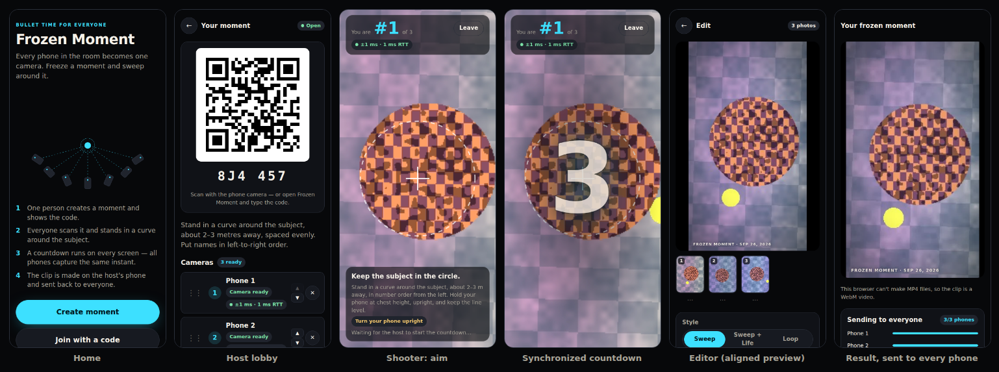

# Frozen Moment

**Every phone in the room becomes one bullet-time camera.**

A free web app — no install, no accounts. One person (the **host**) creates a moment and shows a QR code. Everyone else (the
**shooters**) scans it, joins and stands in an arc around a subject. A synchronized countdown runs on every screen and every phone keeps
the camera frame taken closest to the same instant. The host's phone collects the frames, orders them, aligns them, matches their colours
and renders a short "frozen time" clip that sweeps around the subject — then sends it back to everyone.



- Works in the phone's browser (HTTPS web app, installable as a PWA; once loaded, manual mode even works offline)
- Free to run: static hosting + free signaling. Photos travel phone to phone over WebRTC and are never stored on a server
- 4–24 phones; Android Chrome and iOS Safari

## Status

Everything in the brief is implemented: rooms and QR join, clock sync, the rolling frame buffer, chunked transfers, ordering (manual
and automatic), alignment, colour matching, the three clip styles, export with fallbacks, sending the clip back, the share sheet, manual
mode, Sync Test Mode, the help page and PWA install.

What has been verified, and how:

| Area                                                                                                                                  | Verified by                                                                                                                                                                                                                                                                                                                                                                                   |
| ------------------------------------------------------------------------------------------------------------------------------------- | --------------------------------------------------------------------------------------------------------------------------------------------------------------------------------------------------------------------------------------------------------------------------------------------------------------------------------------------------------------------------------------------- |
| Clock sync, frame selection, transfers (chunking, checksums, retries, drops, resume), room codes, protocol validation, clip timelines | Unit tests with simulated clocks, delays, loss, corruption and disconnects                                                                                                                                                                                                                                                                                                                    |
| Host ↔ shooter sessions (join, re-sync, countdown, capture, 20 s timeout, reconnect + resume, kick, close)                            | Simulated end-to-end tests (`tests/session.test.ts`)                                                                                                                                                                                                                                                                                                                                          |
| Alignment (ORB + RANSAC, subject propagation, levelling, common crop)                                                                 | OpenCV.js in Node on synthetic images with known transforms                                                                                                                                                                                                                                                                                                                                   |
| Colour matching, chirp detection, optical time code, auto order, WebM duration patch                                                  | Unit tests                                                                                                                                                                                                                                                                                                                                                                                    |
| The whole app in a real browser                                                                                                       | `e2e/run.mjs`: host + 3 shooters in separate headless Chromium processes, each with its own synthetic camera feed, over real WebRTC through a local PeerJS server — join, sync, countdown, capture, transfer, OpenCV alignment in the worker, export, clip delivered to all phones; sync-test clock decoding; every export fallback; MP4 box structure; a recorded video matched on the chirp |

**Not yet verified — needs real phones:**

- **H.264/MP4 playback on Android and iOS.** The open-source Chromium used for testing has no H.264 encoder, so the tests exercise the
  MP4 muxer with VP9 (fast-start layout, one sample per frame, per-frame durations — all checked) and the WebM path end to end. Android
  Chrome and iOS Safari 16.4+ ship H.264 encoders, so the MP4 path is what they will use; it still needs a check on devices.
- **Real-world sync accuracy** with Sync Test Mode on 6+ mixed phones — see [Measured sync errors](#measured-sync-errors).
- Camera behaviour on actual phones (frame timestamps, memory limits, sensor-based levelling direction).

## Quick start

```bash
npm install
npm run dev              # http://localhost:5173 (camera works on localhost)
HTTPS=1 npm run dev      # self-signed https on your LAN so phones can use their cameras
```

Phones need a secure origin for the camera: open `https://<your-computer's-LAN-IP>:5173` and accept the certificate warning.

```bash
npm test                 # unit tests (Vitest)
npm run lint             # Prettier check + TypeScript
npm run build            # production build into dist/
node e2e/make-scenes.mjs # once: synthetic camera feeds for the browser test
npm run e2e              # end-to-end test in headless Chromium (screenshots in e2e/artifacts/)
node e2e/clip-frames.mjs # tile frames of the clip the e2e test exported, to eyeball alignment
```

## Using it

1. **Host:** tap **Create moment**. Show the QR code (or read out the six-character code).
2. **Shooters:** scan it, read the privacy note, enter a name, tap **Join & allow camera**. Your screen shows **"You are #3 of 10"**, an
   aiming circle, a crosshair and a level line (cyan when level).
3. **Host:** drag names into left-to-right order and pick upright or sideways phones. Each row shows camera readiness, the clock-sync
   uncertainty and round-trip time (a warning appears above ±25 ms). Optionally **Use my camera too**.
4. **Freeze the moment:** every phone re-syncs, then a 3-2-1 countdown with beeps (and vibration on Android) runs on every screen.
5. Photos arrive on the host in a ring of thumbnails. Anyone who hasn't delivered within ~20 s is left out, and the app says so.
6. **Edit:** tap the subject's centre once. The app finds the same point in every photo, lines them up, levels them and matches their
   colours. Fix any frame by tapping the subject in it, nudging it, or blinking it against its neighbour. Choose **Sweep**,
   **Sweep + Life** or **Loop**, speed (12–18 fps), length (3–6 s), shape (9:16 / 16:9), vignette and caption. **Auto order** suggests
   the left-to-right order from image content.
7. **Create clip:** an MP4 (1080 px on the long side) appears, goes to every shooter automatically, and can be shared or saved.

### Sync Test Mode

In the lobby, tap **Sync test**. The host screen shows a running millisecond clock plus a machine-readable code (a static QR code and a
Gray-coded counter that changes every 1/60 s). Everyone points their phone at it; the app then reads the exact time shown in each phone's
photo and lists every phone's real error next to the phone's own estimate. **Save as calibration** stores each phone's offset (relative to
the group median) on that phone and corrects its timestamps from then on.

### Manual mode (fallback, and for mixed groups)

For when direct connections fail (some mobile networks block them), or for people who can't connect at all:

- The host opens **Manual mode** (from the home screen, or from the lobby for a mixed group) and schedules the moment 30 s – 2 min ahead.
  The screen shows a QR code with the moment's time and the time code; at the moment the host's phone plays a short rising **chirp**.
- Shooters scan the QR with their camera app. Their phone counts down on its own clock; **Sync with host screen** fine-tunes it by
  reading the host's time code through the camera. At the moment the phone keeps its frame; **Send to host** opens the share sheet
  (the file name carries the lineup position).
- No app at hand? Record a short video with the normal camera app covering the moment and send that.
- The host imports photos and videos. For videos, the app finds the chirp in the soundtrack (matched filter) and takes that frame and the
  three after it. Connected phones in the same room count down to the same moment automatically.

## Deploying

Any static host works; the build uses relative paths, so a sub-path is fine.

- **GitHub Pages:** `.github/workflows/pages.yml` builds and deploys on every push to `main`. Enable it once under
  _Settings → Pages → Build and deployment → Source: GitHub Actions_.
- **Cloudflare Pages / Netlify / anything else:** build command `npm run build`, output directory `dist`.

The service worker precaches the app shell (about 95 KB gzipped for the main bundle, ~210 KB including the lazily used export and QR
reader chunks). OpenCV.js (10.9 MB, pinned) is only downloaded when a host starts editing, then cached.

## Signaling: public broker or self-hosted

WebRTC needs a tiny signaling service so phones can find each other. By default the app uses the free public PeerJS broker
(`0.peerjs.com`). It is **best-effort** — no uptime guarantee. For reliability, run your own PeerJS server and build with:

| Variable           | Example            | Meaning                                                   |
| ------------------ | ------------------ | --------------------------------------------------------- |
| `VITE_PEER_HOST`   | `peer.example.com` | Hostname of your PeerJS server                            |
| `VITE_PEER_PORT`   | `443`              | Port                                                      |
| `VITE_PEER_PATH`   | `/fm`              | Path the server is mounted on                             |
| `VITE_PEER_SECURE` | `true`             | Use `wss://` (required when the app is served over https) |
| `VITE_PEER_KEY`    | `peerjs`           | API key (the server's `--key`)                            |

```bash
npx peerjs --port 9000 --key peerjs --path /fm   # put it behind TLS (e.g. a reverse proxy)
VITE_PEER_HOST=peer.example.com VITE_PEER_PORT=443 VITE_PEER_PATH=/fm VITE_PEER_SECURE=true npm run build
```

For GitHub Pages, set these as repository _variables_; the workflow passes them to the build. Only public STUN servers are used (no TURN
relay), so photos always travel directly between phones. The signaling server never sees them.

## How it works

### Clock synchronisation

The host's `performance.timeOrigin + performance.now()` is the reference clock. Each shooter runs an NTP-style exchange over the data
channel: it sends `t0`, the host notes its time on receipt (`h1`) and reply (`h2`), the shooter notes `t1`.

```
offset = ((h1 − t0) + (h2 − t1)) / 2        rtt = (t1 − t0) − (h2 − h1)
```

32 exchanges, 25 ms apart (keeps Wi-Fi radios awake); the fastest 30 % are kept and their median offset used. The uncertainty shown to
the host is half the best round trip. Everyone re-syncs right before each countdown; light re-checks run every 10 s in the lobby.

### Capture: the rolling frame buffer

"Take photo" APIs have unpredictable delays, so the camera streams continuously (rear camera, ideally 1920×1080 at 30 fps) and every frame
is copied as it arrives via `requestVideoFrameCallback`. Frames are stamped with the camera capture time when the browser provides it,
else the presentation time minus an assumed 30 ms (Sync Test calibration measures the real value). The last ~1.5 s are kept as small
copies and the most recent 8–20 frames (depending on a memory budget) at full resolution. Once T plus three frame intervals has passed,
each phone picks the frame whose host-time timestamp is closest to T, plus three neighbours on each side, and reports its timing error.
Expected accuracy: about one video frame (~33 ms at 30 fps) plus the sync uncertainty.

### Transfer

Frames go over a reliable, ordered data channel in 16 KB chunks. Each chunk carries a CRC-32 and the whole file another. The receiver
answers with the list of missing or corrupt chunks and the sender resends only those. Transfers survive dropped connections: the phone
reconnects by itself and asks what already arrived. The main frame (JPEG q0.9, full resolution) goes first, then the neighbours (≤1280 px,
q0.8). Every control message is validated, sizes are capped, and a phone can't open unlimited parallel transfers.

### Alignment

The host taps the subject once. In a Web Worker, OpenCV.js (4.12, pinned) finds ORB features in every frame and matches neighbouring
frames (ratio test + mutual best match). For each neighbouring pair, a RANSAC similarity (shift, rotation, scale) is estimated from
matches near the subject — the background moves differently because of parallax — and falls back to a subject-weighted global estimate.
The subject point is carried from frame to frame; each frame gets a transform that puts the subject at a common point, at the same size,
with the horizon level. Levelling uses each phone's tilt-sensor reading at the capture instant, or the feature chain when readings are
missing. Everything is cropped to the largest common area with the chosen aspect ratio (a small 3-variable LP solved by bisection). The subject
stays exactly centred whenever that keeps at least 90 % of the largest possible crop height.

### Colour matching

Each frame's pixels are described in OKLab. The reference is the "median frame": for each quantile level, the median across frames. Each
frame is histogram-matched towards it per channel, then blended only partway (default 70 % for lightness and 49 % for colour) so skin tones
stay natural. The correction runs per pixel on the GPU (WebGL2 shader with float lookup tables); a Canvas 2D fallback does it on the CPU.

### Clip styles and export

- **Sweep:** left → right → left with short holds, 12–18 fps, 3–6 s.
- **Sweep + Life:** a sweep that ends on the "hero" phone, whose next frames then play so the moment briefly unfreezes.
- **Loop:** ping-pong without repeated end frames, so it loops seamlessly.

Export order: WebCodecs H.264 + [Mediabunny](https://mediabunny.dev) MP4 (fast-start) → WebCodecs VP9/WebM → MediaRecorder (the duration
is written into recorded WebM files so they seek properly) → animated GIF. Mediabunny is the maintained successor of `mp4-muxer`, by the
same author.

## Testing

| Test (spec §13)                                                                            | Where                                               |
| ------------------------------------------------------------------------------------------ | --------------------------------------------------- |
| Clock sync: simulated clocks, random delays, loss, asymmetric links, drift                 | `tests/clockSync.test.ts`                           |
| Frame selection: randomised timestamped frames, closest frame always chosen                | `tests/frames.test.ts`                              |
| Transfer: chunking, CRC-32, retries, corruption, loss, dropped connection + resume, limits | `tests/transfer.test.ts`                            |
| Alignment: synthetic images with known transforms recovered (OpenCV ORB + RANSAC)          | `tests/alignment.test.ts`, `tests/geometry.test.ts` |
| Colour matching: histograms move toward the reference                                      | `tests/color.test.ts`                               |
| Export: MP4/WebM/GIF produced and playable; MP4 structure                                  | `e2e/run.mjs` (browser)                             |
| Whole flow in real browsers over WebRTC                                                    | `e2e/run.mjs`                                       |
| Real-world Sync Test with ≥ 6 phones                                                       | Still to do: [see below](#measured-sync-errors)     |

Other unit tests cover the host/shooter sessions, the chirp matched filter, the optical time code (decoded through jsQR from rendered
perspective photos), auto ordering, room codes, protocol validation, clip timelines and the WebM duration patch.

### Measured sync errors

**Not measured yet.** This needs a real session with at least six different phones (a mix of Android and iPhone). To fill in the table:
join everyone to a moment, open **Sync test**, have everyone point at the host screen, tap **Start test**, and copy the numbers here.
The "spread" is what matters: it is the timing difference between phones.

| Date | Phones (model · browser) | Wi-Fi / hotspot | Spread (max − min) | Largest error | Notes            |
| ---- | ------------------------ | --------------- | ------------------ | ------------- | ---------------- |
| —    | —                        | —               | —                  | —             | not yet measured |

In the automated browser test (all phones on one machine) the sync uncertainty is ±1 ms and all frames align. That only shows the
machinery works; it says nothing about real Wi-Fi or real cameras.

## Honest limits

- Timing between phones is typically within a few hundredths of a second; very fast motion (a ball, a splash) may look slightly
  staggered.
- Different phone cameras and lenses create variation; alignment and colour matching reduce it but don't remove it entirely. The look is
  "stylish stop-motion", not a perfect studio rig.
- Direct connections work best on shared Wi-Fi or a hotspot; some mobile networks block them (use manual mode).
- The free public signaling server is best-effort; self-hosting it makes the app more reliable.
- Phones whose browser doesn't report camera capture times get an assumed 30 ms pipeline correction until a sync test calibrates them.
- Manual-mode video matching depends on the phone's audio/video sync, typically within a frame or two.

## Privacy

Photos travel directly from phone to phone over encrypted WebRTC data channels: to the host, and the finished clip back to the people in
the moment. Nothing is uploaded to a server; the signaling server only introduces the phones. Shooters see a consent notice when joining
and are reminded to get the subject's permission.

## Project layout

```
src/core/      pure logic, no DOM: clock sync, frames, transfer, protocol, geometry, alignment, colour, chirp, time code, timelines
src/session/   host and shooter state machines (network-agnostic; driven by Links)
src/net/       PeerJS signaling and WebRTC data channels as Links
src/media/     camera, rolling frame buffer, countdown sounds, tilt sensor, wake lock
src/process/   OpenCV worker, WebGL renderer, export, media import, time-code reader, editing project
src/ui/        Preact screens (host, shooter, manual mode, editor, help)
tests/         unit tests (Vitest)
e2e/           browser end-to-end test, synthetic camera feeds
build/         Vite plugins: pinned OpenCV vendor file, service worker
```

Stack: TypeScript, Vite, Preact + signals, PeerJS, OpenCV.js, Mediabunny, jsQR, qrcode-generator, gifenc.
